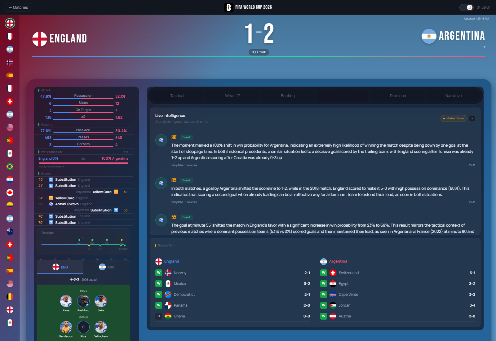
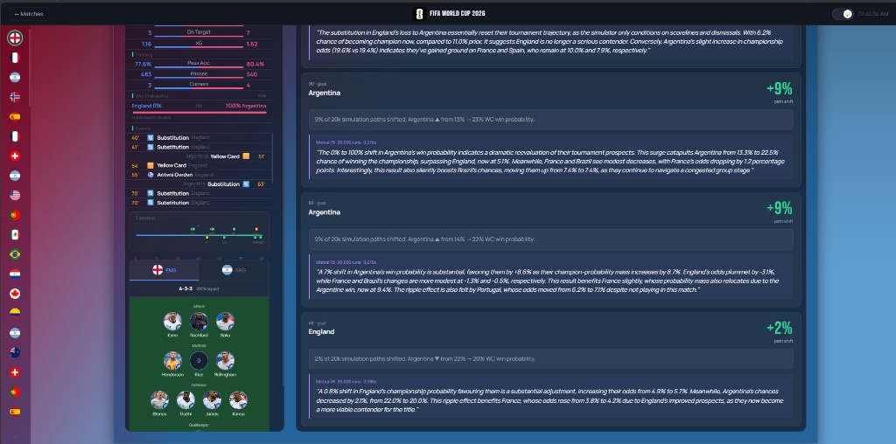
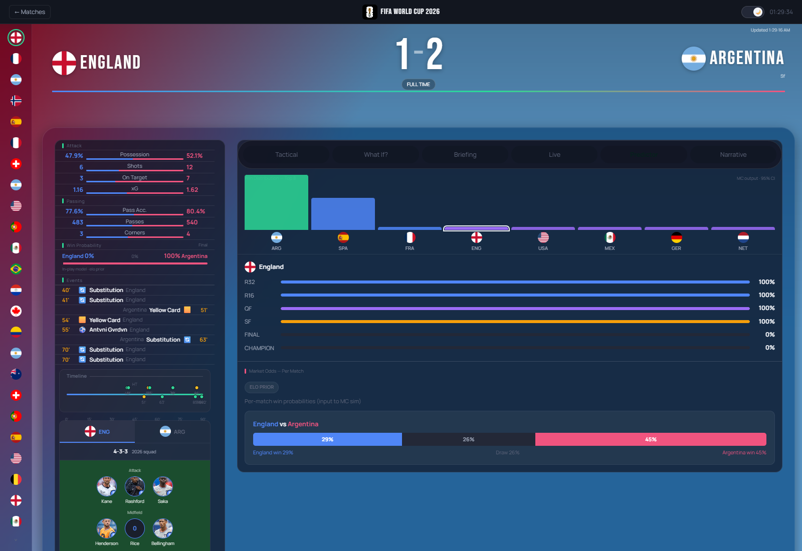
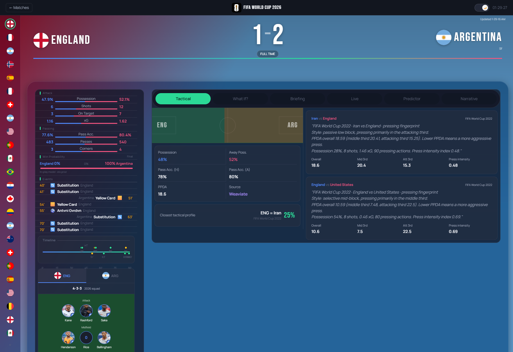
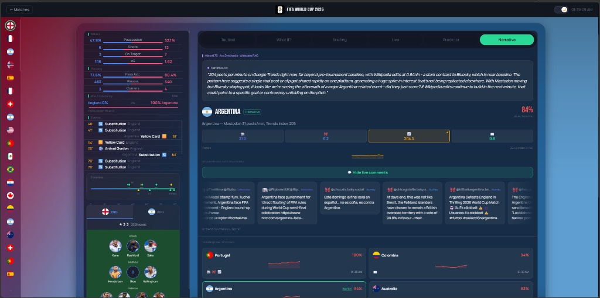
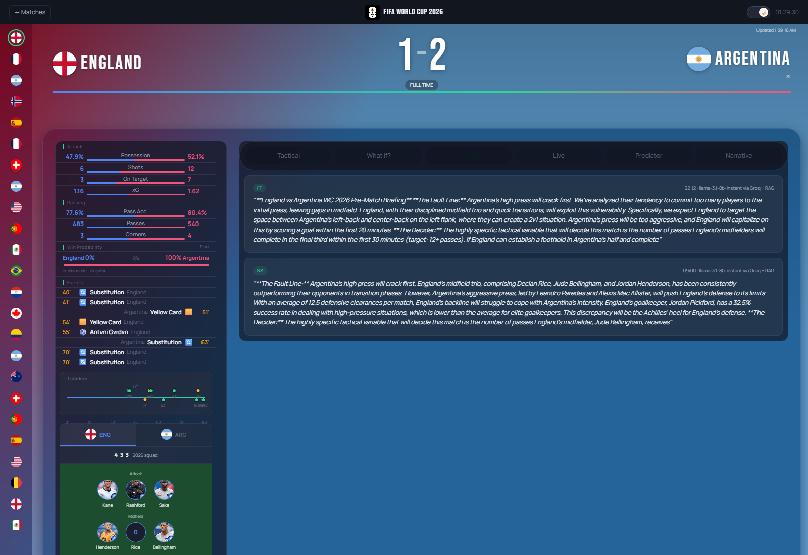

# PitchPulse: FIFA 2026 Live Football Analytics Engine


PitchPulse is a live match tracking, statistical inference, and AI narration engine built for the 2026 World Cup. It ingests bare-bones live score data and mathematically enriches it using historical statistics, vectorized Monte Carlo tournament simulations, and large language models (LLMs). The primary goal is to deliver real-time, push-driven analytical updates: live momentum, counterfactual bracket shifts, and tactical briefings, without relying on an expensive commercial live-stats feed.


The retrieval and agent layers are built from scratch without LangChain, LangGraph, LlamaIndex, or other RAG frameworks. Prompt construction, retrieval logic, agent orchestration, and deterministic fallback paths are implemented directly using the Weaviate client and LLM providers.

The backend follows a single-process architecture to maintain in-memory analytical state, with horizontal scaling achieved through independent application stacks sharing Redis infrastructure.


## Why Build This Project?

### The Need

- Modern football analysis combines live events, social sentiment, tactical insights, and tournament projections, but these signals are typically fragmented across separate platforms.
- Fanatics like myself are left to manually synthesize these signals to answer deeper questions: Why did momentum shift? How significant was that goal? How did a single event change tournament probabilities? etc.
- Advanced analytics such as xG, pressing analysis, and live probability models are often locked behind expensive commercial data providers, leaving free platforms limited to basic score updates.
- The biggest football moments are defined by their downstream impact: a goal, penalty, or red card can reshape qualification paths and championship probabilities across an entire tournament.

### The Problem

- Building real-time football intelligence normally requires commercial feeds containing possession, shots, xG, player tracking, and tactical events.
- The available free live feed (`worldcup26.ir`) provides only basic match state: score, clock, and status.
- Without rich telemetry, traditional approaches cannot provide advanced tactical analysis, probabilistic forecasting, or event impact modeling.

### The Solution

- PitchPulse solves the data limitation through a custom historical enrichment architecture.
- Live 2026 fixtures are dynamically paired with structurally similar historical World Cup matches from StatsBomb Open Data, allowing historical event streams and tactical patterns to enrich sparse live signals.
- The enriched match state powers probabilistic models, vectorized Monte Carlo simulations, retrieval-grounded LLM agents, and real-time event streaming.
- The result is a football intelligence platform that explains live events, generates tactical narratives, and quantifies tournament-wide consequences without requiring commercial sports data licenses.


## Index

* [Why This Project?](#why-this-project)
* [Core Features](#core-features)
* [The Stack](#the-stack)
* [Architecture at a Glance](#architecture-at-a-glance)
* [Evaluation Results](#evaluation-results)
    - [Common Random Numbers: Counterfactual Variance Reduction](#common-random-numbers--counterfactual-variance-reduction)
    - [Narrative Anomaly Detection: IsolationForest Threshold Sweep](#narrative-anomaly-detection--isolationforest-threshold-sweep)
    - [Hybrid Retrieval: Recall/Precision/MRR/NDCG @ K=5, Alpha Sweep](#hybrid-retrieval--recallprecisionmrrndcg--k5-alpha-sweep)
    - [In-Play Model Calibration: Real World Cup Matches (n=12)](#in-play-model-calibration--real-world-cup-matches-n12)
    - [Limitations](#limitations)
* [Performance](#performance)
* [Data Pipeline](#data-pipeline)
    - [Data Ingestion Architecture](#data-ingestion-architecture)
    - [External Data Sources](#external-data-sources)
    - [External Signals](#external-signals)
    - [Schemas](#schemas)
* [The ML Core](#the-ml-core)
* [The Agent Layer](#the-agent-layer)
    - [Match Intelligence Agent](#match-intelligence-agent)
    - [Counterfactual Agent](#counterfactual-agent)
    - [Tactical Agent](#tactical-agent)
    - [Narrative Intelligence Agent](#narrative-intelligence-agent)
    - [Briefing Agent](#briefing-agent)
* [RAG + Knowledge Infrastructure](#rag--knowledge-infrastructure)
    - [Knowledge Construction](#knowledge-construction)
    - [Embedding Pipeline](#embedding-pipeline)
    - [Hybrid Retrieval](#hybrid-retrieval)
    - [Vector Database](#vector-database)
    - [Grounded Generation](#grounded-generation)
* [Real-Time Intelligence Runtime](#real-time-intelligence-runtime)
    - [Worker Architecture](#worker-architecture)
    - [Redis State Layer](#redis-state-layer)
    - [Event Sourcing ](#event-sourcing-partial-implementation)
    - [Async Execution](#async-execution)
    - [Streaming Layer](#streaming-layer)
* [Deep Dive: The Six Core Intelligence Engines](#deep-dive-the-six-core-intelligence-engines)
    - [1. Historical Fixture Pairing Engine](#1-historical-fixture-pairing-engine)
    - [2. Live Win Probability and Momentum Engine](#2-live-win-probability-and-momentum-engine)
    - [3. Live Match Intelligence Engine](#3-live-match-intelligence-engine)
    - [4. Narrative Intelligence Hub](#4-narrative-intelligence-hub)
    - [5. Counterfactual What-If Engine](#5-counterfactual-what-if-engine)
    - [6. Tournament Simulation Engine](#6-tournament-simulation-engine)
* [Performance Optimizations](#performance-optimizations)
* [Repository Structure](#repository-structure)
* [Setup](#setup)
    - [Prerequisites](#prerequisites)
    - [Install and Run](#install-and-run)
    - [Populate the Knowledge Base (offline, one time)](#populate-the-knowledge-base-offline-one-time)
    - [Run the Elo Calibration Backtest](#run-the-elo-calibration-backtest)
* [Tech Stack](#tech-stack)
* [Limitations](#limitations-1)


## Core Features

1.  **Live Match Intelligence**
    - Runs on a 30-second worker cycle using live match state and momentum signals.
    - Evaluates goals, cards, momentum shifts, and scoreline-versus-performance divergence to determine when deeper analysis is required.
    - Uses retrieval-grounded generation for high-value events and deterministic numeric templates for lower-value updates or generation failures.
    - Streams concise match narratives to the frontend through SSE using the same computed metrics as the fallback path.

    
---

2. **The Counterfactual What-If Engine**
    - Analyzes the tournament impact of major match events including goals, cards, penalties, and substitutions.
    - Reconstructs the pre-event state and compares paired tournament simulations to measure how a single event changes championship probabilities.
    - Uses deterministic Monte Carlo simulation with bounded compute controls to isolate event impact.
    - Outputs probability shifts, team-level tournament deltas, and a simulation-grounded explanation.

    
---

3. **The Tournament Simulation Engine**
    - Simulates the complete 48-team World Cup format using Elo ratings with optional market-odds calibration.
    - Uses fully vectorized NumPy execution across group and knockout stages for efficient large-scale Monte Carlo simulation.
    - Produces team advancement probabilities, championship odds, and confidence intervals for tournament predictions.
    - Powers both the prediction API and the counterfactual analysis engine.

    
---

4. **Tactical Intelligence**
    - Converts live match statistics such as possession, shot volume, and passing accuracy into a tactical style representation.
    - Retrieves similar historical pressing fingerprints from the StatsBomb-based tactical index using embedding similarity and Weaviate retrieval.
    - Provides historical tactical comparisons with live-statistics fallback when tactical retrieval is unavailable.

    
---

5. **The Narrative Intelligence Hub**
    - Aggregates Mastodon, Bluesky, Google Trends, and Wikipedia signals every 60 seconds for tracked topics.
    - Uses topic-specific `IsolationForest` anomaly detection over rolling activity histories to identify emerging events and unusual trends.
    - Combines anomaly signals with retrieval-grounded generation to explain whether activity represents isolated virality or broader real-world events.
    - Produces anomaly scores, source attribution, and validated narrative summaries.

    
---

6. **Pre-Match Briefing**
    - Generates pre-match analysis within a scheduled kickoff window using team context and retrieved historical precedent.
    - Produces grounded previews without relying on live match-state signals.

    

## The Stack

* **Backend**
    - FastAPI, single-worker by design
    - `redis.asyncio` as the only persistence layer
* **ML** 
    - Elo rating with Shin de-vigging
    - A Poisson in-play scoring model
    - A vectorized NumPy Monte Carlo tournament simulator
    - An EWMA-smoothed logistic momentum model with a separate offline training pipeline
    - PPDA-based tactical feature engineering
    - A per-topic `IsolationForest` for social/search anomaly detection
* **AI**
    - Local-first inference via **Ollama** running `mistral:7b-instruct-q4_K_M` (accelerated locally by an RTX 3060)
    - **Groq** (`llama-3.3-70b-versatile`) as cloud fallback
    - `sentence-transformers/all-MiniLM-L6-v2` for retrieval embeddings
* **Data**
    - StatsBomb Open Data (real WC 2018/2022 event streams)
    - `worldcup26.ir` (live fixture feed)
    - The Odds API
    - Mastodon/Bluesky/Google Trends/Wikipedia
    - Zafronix/API-Sports for lineups
* **Frontend**
    - Next.js App Router, entirely client-rendered
    - Native `EventSource` API for streaming
    - No WebSocket library, no server-side data fetching


## Architecture at a Glance

```
worldcup26.ir + StatsBomb ──► hybrid_producer (30s poll) ──► MatchState
                                                                   │
                                                                   ⭣
                                                             Redis (only store)
        ┌───────────┬────────────┬───────────────┬────────────┬───────────┬────────────┐
        ⭣           ⭣            ⭣               ⭣            ⭣           ⭣            
   momentum     tactical      intel        counterfactual  narrative   briefing
   worker       worker        worker       worker          worker      worker
   (EWMA)       (Weaviate     (LLM+RAG)    (CRN Monte      (LLM+RAG)   (LLM+RAG)
                cosine)                    Carlo, LLM+RAG)             
        |                                                                
        │           │             │              │              │           │
        │           │             └──────┬───────┴──────────────┴───────────┘
        │           │                    ⭣
        │           │            Agent Layer (Ollama → Groq → template)
        │           │                    │
        ⭣           ⭣                    ⭣
                  FastAPI SSE + REST ──► Next.js UI
```

The platform runs as a single Uvicorn process orchestrating seven recurring asyncio workers plus startup initialization tasks. Workers coordinate exclusively through Redis-backed `MatchState` and pub/sub, producing deterministic analytics (momentum, tactical indexing, probabilistic models) before selectively invoking LLM-based reasoning agents. Runtime caches remain process-local, so horizontal scaling is achieved by deploying additional application instances against a shared Redis server instead of increasing Uvicorn worker count.


## Evaluation Results

Offline and semi-live evaluations of the core ML components, run against real StatsBomb data, live tournament simulations.

> **Data note:** StatsBomb's open-data World Cup coverage is limited to the 2018 and 2022 tournaments (128 total matches).

### Common Random Numbers: Counterfactual Variance Reduction

| Metric | CRN (shared seed) | Independent seeds |
|:---|---:|---:|
| Δ champ prob, mean | +0.03335 | +0.03447 |
| Δ champ prob, std | 0.00212 | 0.00469 |
| **Variance reduction** | **4.9x** | — |

Sharing a seed between the baseline and counterfactual simulation cuts estimator variance 4.9x. Independent seeding requires roughly 5x more simulations to reach the same precision on the event-impact delta.

### Narrative Anomaly Detection: IsolationForest Threshold Sweep

| Threshold | Precision | Recall | F1 | FA/topic-day |
|:---|---:|---:|---:|---:|
| −0.20 | 0.000 | 0.000 | 0.000 | 0.00 |
| −0.15 | 1.000 | 0.097 | 0.178 | 0.00 |
| **−0.10 (production)** | **0.995** | **0.601** | **0.749** | **0.01** |
| −0.05 | 0.879 | 0.964 | 0.920 | 0.41 |
| +0.00 | 0.304 | 1.000 | 0.466 | 7.06 |
| +0.05 | 0.073 | 1.000 | 0.136 | 39.17 |

The deployed threshold (−0.10) operates at 99.5% precision and 60.1% recall, 0.01 false alarms per topic-day. Lower thresholds trade precision for recall: −0.05 reaches 96.4% recall at 0.41 false alarms per topic-day; +0.05 reaches 100% recall at 39.17 false alarms per topic-day.

### Hybrid Retrieval: Recall/Precision/MRR/NDCG @ K=5, Alpha Sweep

Corpus: 96 docs · Queries: 36 · Encoder: `all-MiniLM-L6-v2` (production)

| Alpha | Recall@5 | Precision@5 | MRR | NDCG@5 |
|:---|---:|---:|---:|---:|
| 0.00 (BM25-only) | 1.00 | 0.20 | 0.766 | 0.824 |
| 0.25 | 1.00 | 0.20 | 0.789 | 0.842 |
| 0.50 | 1.00 | 0.20 | 0.845 | 0.884 |
| **0.75 (production)** | **1.00** | **0.20** | **0.944** | **0.959** |
| 1.00 (dense-only) | 1.00 | 0.20 | 0.944 | 0.959 |

Alpha=0.75 ties with pure dense retrieval (alpha=1.00) on MRR (0.944) and NDCG@5 (0.959).

### In-Play Model Calibration: Real World Cup Matches (n=12)

| Checkpoint | Log-loss | Brier |
|:---|---:|---:|
| Pre-match prior | 1.044 | 0.626 |
| Base rate | 1.099 | 0.667 |
| Minute 15 | 1.096 | 0.653 |
| Minute 45 | 0.965 | 0.554 |
| Minute 75 | 0.613 | 0.372 |

Log-loss falls monotonically from minute 15 (1.096) to minute 75 (0.613), dropping below the pre-match prior (1.044) by minute 75 reflecting the model correctly gaining information as the match progresses 


## Performance

| Component | Runs | Time |
|:---|---:|---:|
| Tournament sim (vectorized) | 50,000 | 0.70 s |
| Tournament sim (vectorized) | 10,000 | 0.13 s |
| Counterfactual pair | 20,000×2 | 0.25 s |
| Momentum inference | per call | ~11.3 µs |


## Data Pipeline

### Data Ingestion Architecture

```
 worldcup26.ir            StatsBomb Open Data           The Odds API
 (score, status, clock)   (WC 2018/2022 events)         (bookmaker odds)
        │                          │                          │
        ⭣                          ⭣                          ⭣
 hybrid_producer.py     rag_indexer.py / tactical_indexer.py   odds_api_client.py
 (30s poll)              momentum_trainer.py / backtest_elo    (on demand, 900s TTL cache)
        │               (offline, on demand per proxy match)          │
        ⭣                          ⭣                          ⭣
 status normalize        event replay, feature extraction     consensus average
 scorer parse            narrative + PPDA document build       Shin de-vig
 Elo-distance proxy match
        │                          │                          │
        ⭣                          ⭣                          ⭣
   MatchState / TeamStats    Weaviate (NarrativeArcs,     prior_builder.py
   MatchEvent                TacticalProfiles)            (W/D/L probabilities)
        │                                                       │
        └───────────────────────┬───────────────────────────────┘
                                 ⭣
                              Redis
                    match:{id}:state, match:{id}:momentum,
                    match:{id}:intel:*, predict:*


 Mastodon      Bluesky      Google Trends      Wikipedia
 (search)      (searchPosts)  (pytrends)       (recentchanges)
        │           │              │                │
        └───────────┴──────┬───────┴────────────────┘
                            |
              narrative_spike_detector.py (60s tick)
              per-source rate, mock fallback, four-dim vector
                            ⭣
                          Redis
              narrative:spike:*, narrative:trending:latest
```

### External Data Sources

### External Data Sources

* **Live match state**: `worldcup26.ir`, polled every 30 seconds to retrieve live scores, match status, kickoff time, and scorer information. Responses are normalized into a consistent internal format before entering the analytics pipeline.

* **Historical match data**: StatsBomb Open Data (World Cups 2018 & 2022). Provides full event streams for retrieval-augmented analysis, tactical fingerprint generation, momentum model training, lineup fallback, and historical evaluation. Match-level results are also used separately for Elo calibration.

* **Market data**: The Odds API, refreshed on demand and cached for 15 minutes. Consensus bookmaker odds are aggregated and de-vigged before being used as the preferred pre-match probability source.

* **Lineup data**: Player and formation information is resolved through multiple providers (Zafronix, API-Sports, and StatsBomb) with deterministic fallbacks when official lineups are unavailable.

* **Social and search signals**: Mastodon, Bluesky, Google Trends, and Wikipedia are polled concurrently every 60 seconds to monitor emerging narratives and detect unusual public-interest spikes.

### External Signals

1. Mastodon, Bluesky, Google Trends, and Wikipedia are monitored concurrently every 60 seconds for each tracked topic.

2. When a source is temporarily unavailable or rate-limited, deterministic synthetic activity is generated to preserve pipeline continuity during development and testing.

3. Signals from all sources are normalized into a unified activity representation, allowing heterogeneous social, search, and edit activity to be compared on a common scale.

4. A rolling historical window is maintained for each topic and evaluated by an anomaly-detection model to identify emerging spikes and continuously rank trending topics.

5. The resulting trend signals are consumed by the narrative intelligence pipeline and exposed through the platform's narrative APIs for frontend visualization.

### Schemas

**MatchState** (Pydantic, `api/schemas/schema.py`). Rebuilt every 30 seconds by `hybrid_producer.py`. 

```python
class MatchState(BaseModel):
    fixture_id: int
    league_id: int = 1
    season: int = 2026
    round: str = ""
    venue: str = ""
    referee: str = ""
    status_short: str = "NS"
    status_long: str = "Not Started"
    elapsed: Optional[int] = None
    elapsed_estimated: bool = False
    kickoff_time: Optional[datetime] = None
    home_id: int = 0
    home_name: str = ""
    home_logo: str = ""
    home_score: int = 0
    home_stats: TeamStats = Field(default_factory=TeamStats)
    away_id: int = 0
    away_name: str = ""
    away_logo: str = ""
    away_score: int = 0
    away_stats: TeamStats = Field(default_factory=TeamStats)
    events: list[MatchEvent] = Field(default_factory=list)
    stats_source: str = "unknown"
    stats_proxy_match_id: Optional[int] = None
    updated_at: datetime = Field(default_factory=lambda: datetime.now(timezone.utc))
```

**MatchEvent** (Pydantic, nested in `MatchState.events`). 

```python
class MatchEvent(BaseModel):
    elapsed: int
    extra: Optional[int] = None
    team_id: int
    team_name: str
    player_name: Optional[str] = None
    type: str
    detail: Optional[str] = None
```

**TeamStats** (Pydantic, nested in `MatchState.home_stats` / `away_stats`). Built from replayed StatsBomb events.

```python
class TeamStats(BaseModel):
    possession: float = 0.0
    shots_total: int = 0
    shots_on_goal: int = 0
    shots_off_goal: int = 0
    passes_total: int = 0
    passes_accurate: int = 0
    pass_accuracy: float = 0.0
    corner_kicks: int = 0
    fouls: int = 0
    offsides: int = 0
    yellow_cards: int = 0
    red_cards: int = 0
    goalkeeper_saves: int = 0
    expected_goals: float = 0.0
```

**MomentumState** (dataclass, `ml/momentum_model.py`).

```python
@dataclass
class TeamMomentumState:
    ewma_poss: float = 50.0
    ewma_pass_acc: float = 75.0
    ewma_pressure: float = 0.1
    shot_window: deque = field(default_factory=lambda: deque(maxlen=WINDOW_SLOTS))
    last_shots_total: int = 0
    last_shots_on: int = 0

@dataclass
class MatchMomentumState:
    fixture_id: int
    home: TeamMomentumState = field(default_factory=TeamMomentumState)
    away: TeamMomentumState = field(default_factory=TeamMomentumState)
```


## The ML Core


**Team strength to outcome probability.** Elo expectation:

$$
E_a=\frac{1}{1+10^{\frac{R_b-R_a}{400}}}
$$

Where:

- $E_a$ = expected score for Team A
- $R_a$ = Elo rating of Team A
- $R_b$ = Elo rating of Team B

Converted into a full three-outcome distribution with a rating-gap-sensitive draw model:

$$
p_{\text{draw}}=\mathrm{clip}\left(0.25e^{-\Delta R/450}+0.05,\;0.10,\;0.30\right)
$$

$$
p_{\text{win}}=(1-p_{\text{draw}})E_a
$$

$$
p_{\text{loss}}=(1-p_{\text{draw}})(1-E_a)
$$

where $\Delta R = |R_a - R_b|$ is the absolute rating gap between the two teams.

---

**Market odds** are preferred over Elo when available and de-vigged with **Shin's (1993) method**, which discounts longshot prices less aggressively than a proportional split:

$$
p_i=\frac{\sqrt{z^2+4(1-z)\left(\frac{1}{o_i}\right)^2}-z}{2(1-z)}
$$

where

$$
z=\frac{\Omega}{\Omega+2}
$$

$$
\Omega=\sum_i\frac{1}{o_i}-1
$$

- $p_i$ = fair, de-vigged probability for outcome $i$ (home / draw / away)
- $o_i$ = quoted decimal odds for outcome $i$
- $\Omega$ = overround, the sum of implied probabilities across all outcomes, minus 1
- $z$ = Shin's insider-trading parameter, derived from $\Omega$

---

**In-play win probability** updates live from score, minute, and red cards using two independent Poisson goal processes:

$$
\lambda_{\text{home}}=\max\left(0.02,\;1.3f(1+0.65\sigma)\right)\qquad\lambda_{\text{away}}=\max\left(0.02,\;1.3f(1-0.65\sigma)\right)
$$

$$
P(g_h,g_a)=\mathrm{Pois}(g_h;\lambda_{\text{home}})\cdot\mathrm{Pois}(g_a;\lambda_{\text{away}}),\qquad g_h,g_a\in[0,8]
$$

where

- $\lambda_{\text{home}}$, $\lambda_{\text{away}}$ = expected in-play goal rate for each team over the remaining match
- $f$ is the fraction of the match remaining.
- $\sigma$ is the pre-match win-probability differential.
- $g_h$, $g_a$ = candidate home/away goal counts for the remainder of the match, enumerated over $[0,8]$
- $P(g_h,g_a)$ = joint probability that the match finishes with exactly $g_h$ further home goals and $g_a$ further away goals


---

**Momentum** is EWMA-smoothed and scored by logistic regression, executing in microseconds with fully inspectable inputs:

$$
\mathrm{EWMA}_t=\alpha x_t+(1-\alpha)\mathrm{EWMA}_{t-1},\qquad\alpha=0.3
$$

$$
P(\text{goal within 5 min})=\sigma\left(\beta_0+\sum_i\beta_i\,\mathrm{feature}_i\right)+\sum_k\mathrm{bump}_k(0.8)^{\Delta t_k}
$$

- $x_t$ = raw input signal at tick $t$ (possession, pass accuracy, or pressure)
- $\mathrm{EWMA}_{t-1}$ = previous smoothed value of that signal
- $\alpha$ = smoothing factor
- $\sigma(\cdot)$ = logistic sigmoid function
- $\beta_0$ = intercept; $\beta_i$ = trained coefficient for $\mathrm{feature}_i$ (EWMA-smoothed pressure, possession, pass accuracy, match minute, score differential)
- $\mathrm{bump}_k$ = initial magnitude of the $k$-th active event bump (goal or red card)
- $\Delta t_k$ = ticks elapsed since event $k$ occurred

$\Delta t_k$ is measured in 30-second ticks (two per minute). Event contributions decay exponentially over time, allowing impactful events to influence predictions immediately while their effect gradually diminishes. Goals and red cards inject the largest momentum shifts into the model. Coefficients are trained offline on historical StatsBomb World Cup data and promoted only after outperforming a baseline on held-out evaluation matches.

---

**Tournament simulation** resolves every simulated match and knockout round for all $N$ runs simultaneously through vectorized NumPy operations:

$$
\text{margin}=1.96\sqrt{\frac{\hat{p}(1-\hat{p})}{N}}
$$

- $\hat{p}$ = simulated probability estimate for a given stage outcome (e.g. reaching the quarterfinal)
- $N$ = number of simulation runs
- $\text{margin}$ = half-width of the 95% confidence interval around $\hat{p}$

---

**Tactical identity** is derived through feature engineering and cosine retrieval:

$$
\mathrm{PPDA}=\frac{\text{Opponent completed passes in press zone}}{\text{Defensive actions in press zone}}
$$

$$
\text{press}\_\text{intensity}=0.7\,\min\left(1,\frac{8}{\mathrm{PPDA}}\right)+0.3\,\min\left(1,\frac{\text{pressures}}{150}\right)
$$

- $\mathrm{PPDA}$ = passes per defensive action. A lower value indicates more aggressive pressing.
- $\text{pressures}$ = count of raw pressure events recorded in the press zone.

---

**Narrative anomaly detection** fits a separate `IsolationForest` (`contamination=0.05`, 100 estimators) per tracked topic, refit every 30 ticks on a rolling 72-hour window of four-source activity, scoring every new observation against it. Per-topic baselines correct for activity volume differences between heavily-followed and lightly-followed teams:

$$
\mathrm{severity}=\mathrm{clip}\left(\frac{-s-0.10}{0.5},0,1\right)
$$

where $s$ is the raw anomaly score. A spike fires when:

$$
s < -0.10
$$

outside a 300-second per-topic cooldown window.

<br />


## The Agent Layer

Every agent computes a deterministic analytical result before any generation step. The language model is used only to narrate and explain precomputed outputs, not to determine conclusions. Agents use retrieval grounding or simulation outputs depending on their role, with deterministic fallbacks available when generation is unavailable.

### Match Intelligence Agent

* Runs every 30 seconds against the live `MatchState` and momentum snapshot.
* Detects high-impact match developments by scanning uncovered events (goals/cards), momentum changes, and xG-versus-scoreline divergence, including situations where no discrete event has occurred.
* During lower-activity periods, performs periodic tactical reads using live possession and pressure signals.
* Selects retrieval context based on the detected scenario: event-driven analysis uses goal/card narrative data, xG divergence uses broader historical match context, and tactical analysis uses pressing-fingerprint data.
* Retrieved context is combined with live scoreline, xG, and momentum features to produce grounded match intelligence.
* Uses local-first LLM inference for high-priority insights (goals, cards, scheduled tactical reads, or high-relevance situations), while deterministic numeric templates provide fallback responses when generation is skipped or unavailable.

### Counterfactual Agent

* Triggers on major match events (goals, cards, penalties, own goals, and substitutions) with a 45-second minimum gap per fixture to prevent duplicate analysis.
* Reconstructs the pre-event match state by reversing the impact of the triggering event on score and disciplinary state.
* Converts the observed in-play probability change into a bounded Elo adjustment representing the event's impact.
* Runs paired 20,000-run tournament simulations using identical deterministic seeds, isolating the effect of the event-driven adjustment between pre-event and post-event scenarios.
* Identifies the teams and outcomes with the largest probability shifts and passes the simulation results, along with the in-play win-probability change, into the local-first generation pipeline.
* A deterministic fallback template reproduces the same explanation using the computed simulation outputs when generation is unavailable.

### Tactical Agent

* Uses a fully deterministic pipeline with no generative step.
* Converts live possession, shot volume, and passing accuracy into a tactical style descriptor that approximates unavailable pressing metrics from the live feed.
* Embeds the descriptor and retrieves the closest historical pressing fingerprints from Weaviate using cosine similarity, including additional comparable profiles for context.
* Returns the best available tactical match from the indexed profiles, with live-statistics fallback when tactical retrieval data is unavailable.

### Narrative Intelligence Agent

* Consumes trending topics and anomaly signals generated by the external-signal pipeline, which aggregates multiple social and search sources and scores topic activity using per-topic `IsolationForest` models.
* Builds topic-aware queries and retrieves historical narrative context from the narrative retrieval collection.
* Uses source-level activity patterns to distinguish isolated viral signals from broader real-world events, grounding generated narratives in the observed signal distribution rather than raw volume alone.
* Applies output validation and filtering before serving results, with a rule-based fallback that reproduces the same reasoning path when generation is unavailable or fails validation.
### Briefing Agent

* Generates pre-match briefings within a scheduled pre-kickoff window, once per match status, or on demand using team context and retrieved historical precedent. It does not consume live match-state signals.
* Retrieves relevant historical context from the narrative collection and constrains generation to retrieved evidence.
* Uses a deterministic fallback that summarizes available retrieved context when generation is unavailable, ensuring the agent always returns a valid briefing.
* Uses Groq-based inference directly for generation, while the other live agents follow the platform's local-first inference strategy.

Three of the five agents operate continuously during live play using local-first inference, reducing network latency and external API dependency for time-sensitive match intelligence. All agents include deterministic template fallbacks built from the same computed outputs, ensuring graceful degradation without fabricated statistics or empty responses.


## RAG + Knowledge Infrastructure

### Knowledge Construction

1. Historical StatsBomb event streams power both retrieval collections used by the intelligence agents.
2. Historical events are transformed into structured natural-language documents with metadata such as `match_id`, competition, season, minute, and event type for grounded retrieval.
3. Tactical knowledge is built separately by computing team-level pressing features, including PPDA and pressing-zone statistics, into dedicated tactical profiles.
4. Knowledge indexing runs offline through CLI workflows, with the tactical index supporting automatic population on startup when no indexed profiles are available.

### Embedding Pipeline

1. Documents are stored as self-contained retrieval passages, eliminating the need for additional chunking during indexing.
2. Embeddings are generated using `sentence-transformers/all-MiniLM-L6-v2` with normalized vectors for similarity search.
3. Vectors and structured metadata are stored together in Weaviate for retrieval and filtering.
4. Embedding workloads execute asynchronously through a dedicated thread pool to avoid blocking the main application loop.

### Hybrid Retrieval

1. Dense retrieval uses cosine similarity over embedding vectors to capture semantic relevance.
2. BM25 retrieval provides keyword-based matching over the same document corpus.
3. Hybrid retrieval combines both approaches using weighted fusion with a 75% dense retrieval preference (`alpha=0.75`).
4. Narrative retrieval applies event-type filtering (such as `goal` or `red_card`) when context is known, improving precision over similarity search alone.

### Vector Database

Weaviate 1.27 is configured without a built-in vectorizer. All embeddings are generated externally and supplied with each insert, giving the application full control over the embedding pipeline.

* `NarrativeArcs` stores historical goal, red-card, and momentum-shift narratives used for retrieval-grounded analysis.
* `TacticalProfiles` stores team-level tactical fingerprints, including PPDA and pressing features, for similarity-based tactical retrieval.
* Index population is controlled through offline ingestion workflows, with collection size determined by successfully processed historical data.

### Grounded Generation

1. Retrieval returns the most relevant historical context for each query, with top-ranked passages incorporated into generation prompts.
2. Prompts combine retrieved evidence with computed match metrics such as scoreline, xG, probability changes, and activity signals.
3. Narrative and briefing generation are constrained to retrieved context and computed outputs to reduce unsupported claims.
4. When generation is unavailable, deterministic templates reuse the same computed values to provide a reliable fallback response.


## Real-Time Intelligence Runtime

### Worker Architecture

| Worker | Cadence | Responsibility |
|:---|:---|:---|
| Producer | 30s | Polls the live feed, reconstructs `MatchState` |
| Momentum | 30s | EWMA and logistic inference |
| Intel | 30s | Event, xG, and tactical scoring; live narration |
| Counterfactual | 30s | Trigger detection; paired Monte Carlo; bracket-impact narration |
| Tactical | 120s | Style descriptor; cosine match against history |
| Briefing | 300s | Pre-match window gating; tactical preview |
| Narrative | 60s | Social signal aggregation; anomaly scoring; arc synthesis |

Only seven recurring workers operate in the system, with additional one-time startup tasks for initial intelligence seeding and tactical-index initialization. Simulation requests create short-lived tasks on demand through `predict.py`.

### Redis State Layer

* Redis serves as the central state layer for live match state, momentum snapshots, intelligence feeds, counterfactual results, narrative signals, and simulation outputs.
* State is managed with TTL-based expiration policies across different match lifecycle stages, from pre-kickoff preparation through completed analysis history.
* Redis pub/sub channels distribute real-time updates for match state, momentum, intelligence, counterfactual analysis, and narrative events. Tactical and briefing outputs are consumed through their respective state access paths.

### Event Sourcing

* The system uses state reconstruction rather than full event sourcing: `MatchState` is updated in place rather than stored as a durable event log.
* Worker restarts recover tracking state from persisted Redis snapshots, preventing duplicate processing of previously handled match events.
* Live timeline changes are detected through match-state validation, allowing workers to reset fixture-specific caches when stale state is detected.

### Async Execution

1. All seven recurring workers and startup initialization tasks run as `asyncio` tasks within a shared event loop and Redis connection rather than separate processes.
2. Worker failures are isolated through per-task exception handling, preventing a single malformed fixture or failed execution from stopping the broader pipeline.
3. Blocking and CPU-intensive operations are moved off the event loop through dedicated thread pools for simulations, embeddings, and external API operations.

### Streaming Layer

* SSE endpoints subscribe to Redis pub/sub channels and hydrate initial state from Redis, allowing clients to receive the latest match context immediately after connecting.
* Frontend consumers use the browser's native `EventSource` reconnection behavior for connection recovery.
* Real-time match intelligence, momentum, counterfactual, and narrative updates are streamed through SSE, while social-comment data follows a separate polling-based path backed by cached provider results.


## Deep Dive: The Six Core Intelligence Engines

These subsystems operate as dedicated reasoning and simulation engines rather than simple LLM wrappers.### 1. Historical Fixture Pairing Engine

The free live feed (`worldcup26.ir`) provides only basic match state such as score, clock, and status, without possession, shots, xG, or tactical telemetry. `StatsBank`, integrated into `hybrid_producer.py`, bridges this gap by mapping each live 2026 fixture to a structurally similar historical match from StatsBomb WC 2018/2022 Open Data and replaying that event stream as a statistical proxy.

**Fixture Matching Pipeline**

* Matching is resolved once per fixture and cached for the full match lifecycle.
* Uses a three-stage matching strategy:
    - **Exact pairing:** Matches live team combinations directly against historical StatsBomb fixtures when a previous meeting exists.
    - **Elo-distance nearest neighbor:** When no direct historical match exists, ranks candidate fixtures by combined Elo similarity:

$$
\text{cost}=
\left|\mathrm{Elo}^{sb}_{h}-\mathrm{Elo}^{live}_{h}\right|
+
\left|\mathrm{Elo}^{sb}_{a}-\mathrm{Elo}^{live}_{a}\right|
$$

- Selects the historical fixture with the closest team-strength profile rather than an arbitrary match.
- **Orientation correction:** Normalizes historical home/away ordering to match the live fixture without modifying the shared historical cache.

**Historical Event Replay**

* After pairing, the historical event stream is processed into chronological match snapshots.
* Snapshots include derived statistics such as:
    - Shots and shot quality metrics
    - Expected goals (xG)
    - Passing activity
    - Corners
    - Fouls and cards
    - Goalkeeper actions
* Cards and substitutions are integrated as anonymized proxy events because historical player identities do not correspond to live fixtures.

**Live Integration**

* Each 30-second live update retrieves the historical snapshot corresponding to the current match minute.
* This keeps derived statistics, xG trends, and momentum signals consistent throughout the full match lifecycle instead of changing proxies between updates.
### 2. Live Win Probability and Momentum Engine

Two independent low-latency probabilistic models convert live match signals into real-time intelligence: one estimates match outcome probabilities, while the other measures short-term attacking pressure and momentum.

**In-play Win Probability** (`ml/in_play.py`)

* Updates pre-match win/draw/loss priors using live match context including game minute, scoreline, and disciplinary state.
* Models remaining goals using adjusted Poisson processes that account for team strength and match-state effects.
* Enumerates possible final score outcomes and aggregates probabilities into win/draw/loss estimates based on the current score differential.
* Resolves directly from the final score when the match reaches full time instead of relying on probabilistic projections.
* Converts probability movement into bounded Elo adjustments through `elo_deltas()`.
* Provides the event-impact signal used by the Counterfactual Engine and live-adjusted tournament simulations.

**Momentum Model** (`ml/momentum_model.py`)

* Produces a separate short-term pressure signal representing which team is currently more likely to create danger.
* Builds shot pressure through a multi-stage pipeline:
    - Tracks recent shot activity through a rolling time window.
    - Converts shot volume into a shots-per-minute rate.
    - Adjusts for shot quality using on-target ratios.
    - Applies EWMA smoothing to prevent single-tick spikes from creating unstable momentum swings.
* Incorporates possession and passing signals with early-match noise controls.
* Uses a logistic regression model to estimate near-term scoring probability from smoothed match features.
* Applies exponentially decaying event impacts:
    - Goals and red cards create immediate momentum shifts.
    - Effects gradually decay over subsequent minutes instead of persisting indefinitely.
* Loads trained coefficients from calibration artifacts when available.
* Falls back to calibrated defaults when model parameters are unavailable or unreliable.

### 3. Live Match Intelligence Engine

Runs a relevance-gating pipeline every 30 seconds per fixture. Most updates are filtered without an LLM call, making generation an exception for high-value moments rather than the default execution path.

**Relevance Scoring Pipeline**

* Computes a priority score using:
    - Uncovered goals and red cards
    - Momentum changes since the last narrated snapshot
    - xG-versus-scoreline divergence
    - Stoppage-time and extra-time context
* Uses a content hash over the current scoreline, momentum state, and latest event to detect unchanged states.
* Prevents repeated narratives when the underlying match context has not meaningfully changed.

**Narrative Gating**

* Low-priority ticks are skipped below the relevance threshold unless a forced trigger occurs.
* Forced generation paths include:
    - A baseline match narrative after the fixture reaches an initial live-state milestone.
    - Periodic tactical analysis based on match-time progression rather than wall-clock time.
* Match-time scheduling keeps narration cadence consistent even when replay speed or execution timing changes.

**Retrieval-Grounded Analysis**

* Surviving updates are classified into three narrative categories:
    - **Event reaction:** Triggered by goals or cards.
    - **xG divergence:** Detects when performance differs from the scoreline.
    - **Tactical analysis:** Generates broader match-style insights.
* Each category uses a specialized retrieval path:
    - Event and xG analysis retrieve from `NarrativeArcs` weaviate vectorDB.
    - Tactical analysis retrieves from `TacticalProfiles`  weaviate vectorDB.
* Retrieved context is combined with live match metrics before generation.

**Generation and Fallback Strategy**

* Local LLM generation is reserved for high-value updates such as:
    - Major events
    - Forced tactical reads
    - High-relevance match states
* Lower-value updates use deterministic templates built from the same computed metrics.
* Failed generation also falls back to deterministic output, ensuring the intelligence feed remains available without fabricated information.

**Post-Match Event Timeline**

* Maintains a separate event-driven timeline independent of the rolling live narrative stream.
* Generates retrieval-grounded reactions for every major event, including:
    - Goals
    - Red cards
* Produces a full-time summary for every fixture, including matches without major events by using xG and possession-based analysis.
### 4. Narrative Intelligence Hub

A 60-second worker aggregates Mastodon, Bluesky, Google Trends, and Wikipedia signals into topic-level feature vectors for anomaly detection. The pipeline operates independently from `MatchState` and live-match processing, using multi-source activity patterns to identify broader real-world events rather than isolated spikes.

**External Signal Collection**

* Four sources are processed concurrently for each tracked topic:
    - **Mastodon:** Authenticated social search signals with automatic fallback handling.
    - **Bluesky:** Social activity signals through authenticated API search with session recovery.
    - **Google Trends:** Search-interest signals collected through `pytrends` with isolated blocking I/O execution.
    - **Wikipedia:** Recent-change velocity used as a reference activity signal.
* When providers are unavailable, deterministic mock signals maintain pipeline continuity while preserving topic-specific activity patterns with controlled variability.

**Anomaly Detection Pipeline**

* Maintains topic-specific rolling activity histories to model normal behavior.
* Uses independent topic-level `IsolationForest` models rather than a shared global baseline, allowing different topics to maintain their own activity profiles.
* Continuously scores incoming observations to identify unusual activity patterns.
* Applies rate limiting to avoid repeatedly triggering alerts for the same event.

**Signal Attribution and Narrative Generation**

* Identifies contributing sources by comparing current activity against historical baselines.
* Maintains a separate trending ranking based on relative activity changes across tracked topics.
* Converts detected anomalies and trending topics into retrieval queries against the narrative knowledge collection.
* Combines retrieved historical context with observed signal patterns to generate grounded narratives.
* Uses output validation and deterministic fallback templates to keep narratives aligned with computed signals and retrieved evidence.

Each execution produces:
- Anomaly score
- Source attribution
- Retrieval-grounded narrative summary
### 5. Counterfactual What-If Engine

* Evaluates tournament impact beyond simple scoreline changes by measuring how individual match events alter championship probabilities.
* Converts live events into tournament-wide probability shifts through paired Monte Carlo simulations, powering the match page's "What If?" analysis and bracket-impact predictions.
* Detects major events such as goals, cards, penalties, and substitutions, then reconstructs the pre-event match state before calculating impact.
* Computes in-play win probabilities before and after the event and converts the change into a bounded Elo adjustment.
* Compares pre-event and post-event tournament simulations to quantify each team's championship probability movement.
* Uses deterministic seeding across simulations to isolate the effect of the event-driven adjustment from random Monte Carlo variance.

$$
\Delta p_i = p_i^{after} - p_i^{before}
$$

The aggregate tournament impact is derived from the total probability movement across teams:

$$
\text{path shift} = \min\left(1,\frac{\sum_i |\Delta p_i|}{2}\right)
$$


### 6. Tournament Simulation Engine

* Simulates the complete 48-team World Cup structure across group and knockout stages, including third-place advancement and complex knockout paths.
* Provides the prediction backend for tournament forecasts and the Counterfactual Engine without requiring LLM generation or retrieval.
* Uses fully vectorized NumPy execution for group-stage and knockout simulations instead of sequential per-match loops.
* Applies optimized array-based processing for bracket advancement and probability aggregation across large Monte Carlo runs.
* Achieves approximately 0.70 seconds for 50,000 tournament simulations, enabling low-latency prediction and live counterfactual analysis.


## Performance Optimizations

* **Vectorized Monte Carlo simulation.** Tournament simulation uses NumPy vectorization across group and knockout stages instead of per-simulation loops, enabling 50,000 tournament runs in approximately 0.70 seconds.

* **Dedicated execution pools.** Separate thread pools isolate simulation workloads, embedding operations, and blocking I/O, preventing expensive tasks from delaying real-time asyncio workers and SSE delivery.

* **TTL-based caching with failure resilience.** External data such as bookmaker odds and roster information use cached snapshots with stale-on-failure behavior, reducing dependency on external API latency.

* **Redis-backed caching for expensive computations.** Tactical fingerprints, external lookups, and derived intelligence artifacts are cached to avoid repeated computation and retrieval work.

* **Change-aware state publishing.** Redis writes and pub/sub notifications are only triggered when serialized match state changes, reducing unnecessary SSE updates during idle periods.

* **Rate-limited intelligence generation.** Expensive simulation and LLM generation paths use fixture-level and topic-level cooldowns, preventing redundant inference and computation.

* **Deterministic simulation optimization.** Counterfactual simulations use shared random seeds to isolate event impact and avoid unnecessary recomputation when the adjustment is insignificant.

* **Lazy model initialization.** Embedding models are loaded once and reused across requests through shared module-level instances.

* **Batched offline indexing.** RAG and tactical indexing pipelines encode documents in batches to reduce embedding overhead during knowledge construction.

* **Hybrid retrieval optimization.** Weaviate hybrid search combines dense vector similarity and BM25 retrieval in a single query, avoiding separate retrieval pipelines and client-side merging.


## Repository Structure

```
backend/
├── agents/
│   ├── briefing_agent.py            Pre-match briefing generation, Groq only, no local-first tier
│   ├── counterfactual_agent.py      Paired CRN Monte Carlo simulation and bracket-impact narration
│   ├── match_intel_agent.py         Live event/xG/tactical scoring and narrative generation
│   ├── narrative_arc_agent.py       Evidence-grounded narrative synthesis for detected spikes
│   ├── narrative_spike_detector.py  Four-source signal aggregation and per-topic IsolationForest
│   ├── narrative_topics.py          Fixture-aware dynamic topic tracking, defined but unused
│   ├── ollama_client.py             Local Ollama call with Groq fallback, shared by three
│   │                                agents (match intel, counterfactual, narrative arc)
│   ├── rag_indexer.py               Offline StatsBomb narrative document extraction and indexing
│   ├── tactical_agent.py            Live style descriptor and cosine match against TacticalProfiles
│   └── weaviate_client.py           Weaviate connection, collection schema, hybrid search wrapper
├── api/
│   ├── main_hybrid.py               FastAPI app, lifespan worker orchestration, single-process guard
│   ├── routes/
│   │   ├── _security.py             Trigger-token dependency for debug endpoints
│   │   ├── _sse.py                  Shared Redis pub/sub-backed SSE generator
│   │   ├── briefing_routes.py       Briefing feed and trigger endpoints
│   │   ├── comment_sampler.py       Duplicate comment-sample storage, not mounted in the app
│   │   ├── counterfactual_routes.py Counterfactual feed, prediction, and live-prob endpoints
│   │   ├── group_table.py           Live group-stage standings from completed fixtures
│   │   ├── intel.py                 Intel feed and SSE stream endpoints
│   │   ├── lineups.py                Tiered lineup resolution across four providers
│   │   ├── match.py                 Fixture list and summary endpoints
│   │   ├── match_stream.py           Match-state SSE stream
│   │   ├── momentum.py              Momentum snapshot and SSE stream
│   │   ├── narrative.py             Spike, trending, arc, and narrative SSE endpoints
│   │   ├── narrative_comments.py    Comment sample storage and retrieval
│   │   ├── predict.py               Tournament simulation trigger, status, and result endpoints
│   │   ├── tactical.py              Tactical fingerprint endpoint and cache
│   │   └── team_form.py             Last-five-match form endpoint
│   ├── schemas/
│   │   ├── event_types.py           Shared event-type and status-code vocabulary
│   │   ├── intel_schema.py          Pydantic intel schema, defined but unused at runtime
│   │   ├── predict.py               Validated prediction response models
│   │   └── schema.py                MatchState, MatchEvent, TeamStats definitions
│   └── workers/
│       ├── briefing_worker.py       300s kickoff-window scan and briefing trigger
│       ├── counterfactual_worker.py 30s trigger detection and simulation dispatch
│       ├── hybrid_producer.py       30s live-feed poll and MatchState reconstruction
│       ├── intel_worker.py          30s event/momentum scoring and narration dispatch
│       ├── momentum_worker.py       30s EWMA and logistic inference per fixture
│       ├── narrative_worker.py      60s signal aggregation, anomaly scoring, arc synthesis
│       └── tactical_worker.py       120s tactical fingerprint refresh
├── ml/
│   ├── backtest_elo_wdl.py          Elo calibration backtest against real WC 2018/2022 results
│   ├── executors.py                 Dedicated thread pools for simulation, embedding, and I/O
│   ├── in_play.py                   Poisson in-play W/D/L model and Elo delta conversion
│   ├── momentum_model.py            Online EWMA and logistic momentum inference
│   ├── momentum_trainer.py          Offline momentum coefficient training and validation gate
│   ├── odds_api_client.py           Odds API client with TTL cache and stale-on-failure fallback
│   ├── prior_builder.py             Elo-to-WDL and Shin de-vig probability construction
│   ├── schemas/
│   │   └── momentum_schema.py       Pydantic momentum schema, defined but unused at runtime
│   ├── statsbomb.py                 Shared StatsBomb parsing constants and helpers
│   ├── tactical_indexer.py          Offline PPDA feature extraction and TacticalProfiles indexing
│   ├── team_names.py                Team name alias mapping across three naming systems
│   ├── tournament_sim.py            Vectorized Monte Carlo group and knockout simulator
│   └── wc_2026_config.py            Static 48-team Elo configuration, groups, and bracket
├── Dockerfile
└── requirements.txt

ui/
├── app/
│   ├── layout.tsx                   Root layout, navigation, theme initialization
│   ├── page.tsx                     Match Center fixture list
│   ├── match/[id]/page.tsx          Live match detail page
│   ├── narrative/page.tsx           Narrative Hub page
│   └── predict/page.tsx             Tournament predictor page
├── components/
│   ├── Flag.tsx, NavBar.tsx, ThemeToggle.tsx, theme-provider.tsx   Shared UI chrome
│   ├── match/                       Score, stats, momentum, tactical, counterfactual, lineup panels
│   ├── narrative/CommentBubbles.tsx Auto-scrolling live comment sample row
│   └── predict/                     Group, bracket-impact, and probability chart panels
├── hooks/
│   ├── useCounterfactualStream.ts, useIntelStream.ts, useMatchStream.ts,
│   │   useMomentumStream.ts, useNarrativeStream.ts   One SSE hook per Redis pub/sub channel
│   ├── useMatchBriefing.ts, useMatchPrediction.ts, usePredictStream.ts, useTactical.ts
│   │                                Polling hooks for non-SSE endpoints
│   └── useTheme.ts                  Light/dark theme state
├── lib/flag.ts
├── types/match.ts, predict.ts       TypeScript mirrors of the backend Pydantic schemas
└── package.json, next.config.js, tsconfig.json

docker-compose.yml     Redis 7 + Weaviate 1.27 + API, single replica; UI runs separately
weaviate_data/         Bind-mounted Weaviate volume, runtime data, not source
```


## Setup

### Prerequisites

* Docker (for Redis 7 and Weaviate 1.27)
* Python 3.12
* Node.js (for the Next.js UI)
* Ollama, optional, required only to engage the local-first LLM tier (`mistral:7b-instruct-q4_K_M`)

### Install and Run

```bash
# infrastructure
docker compose up -d redis weaviate

# backend
cd backend
pip install -r requirements.txt
ollama pull mistral:7b-instruct-q4_K_M   # optional
uvicorn api.main_hybrid:app --reload --port 8000

# frontend
cd ui
npm install
npm run dev
```

### Populate the Knowledge Base (offline, one time)

```bash
python -m agents.rag_indexer        # NarrativeArcs, ~500 StatsBomb matches
python -m ml.tactical_indexer       # TacticalProfiles, also auto-runs on first empty-collection startup
```

### Run the Elo Calibration Backtest

```bash
PYTHONPATH=. python ml/backtest_elo_wdl.py --json report.json
```

## Tech Stack

| Category | Stack |
|:---|:---|
| Languages | Python 3.12, TypeScript |
| ML | NumPy, scikit-learn (`IsolationForest`), `sentence-transformers` (`all-MiniLM-L6-v2`) |
| Backend | FastAPI, Uvicorn, `sse-starlette`, Pydantic v2, `httpx`, `redis.asyncio`, `weaviate-client` |
| Frontend | Next.js 14 App Router, React 18, `next-themes` |
| Data | Redis 7, Weaviate 1.27 |
| Infra | Docker Compose, `python-dotenv`, `python:3.12-slim` base image, `gcc` (build-time, scientific Python wheels) |
| Dev / Testing | `pytest`, `ruff` |
| External data | StatsBomb Open Data, `worldcup26.ir`, The Odds API, API-Sports, Zafronix, Mastodon, Bluesky, Google Trends (`pytrends`), Wikipedia REST |
| AI | Ollama (`mistral:7b-instruct-q4_K_M`), Groq (`llama-3.3-70b-versatile`) |

## Limitations

* **Predictions remain probabilistic.** Tournament simulations produce probability distributions with confidence intervals rather than deterministic outcomes. Model performance depends on calibration quality and historical data coverage.

* **The architecture requires persistent execution.** Long-running workers, in-memory analytical state, and background processing make the platform better suited for persistent services than request-based serverless environments.

* **Live updates are bounded by upstream data availability.** Match state refreshes depend on the polling interval of the external feed, so events occurring between polls may not appear immediately.

* **External signal quality depends on provider availability.** Social and search sources operate under external API limits and may fall back to synthetic signals when unavailable.

* **Live 2026 match statistics use historical proxies.** When real-time telemetry is unavailable, live analytics such as possession, shots, and xG are approximated using historically similar StatsBomb matches rather than actual in-game tracking data.

* **The platform uses a hybrid free-data strategy.** The system combines StatsBomb Open Data with free live match feeds instead of relying on paid providers, trading complete live telemetry coverage for broader accessibility and reproducibility.

* **Counterfactual analysis estimates probability impact rather than replaying alternate match decisions.** The engine models event-driven changes in team strength and tournament outcomes, not alternate tactics or coaching decisions.

* **Retrieval grounding improves reliability but does not guarantee factual generation.** Prompt constraints, filtering, and deterministic fallbacks reduce unsupported outputs, but generated narratives are not independently scored with a faithfulness metric.

* **Single-process execution limits scaling strategy.** Horizontal scaling is achieved through independent application instances sharing Redis and Weaviate rather than increasing worker count within one process.